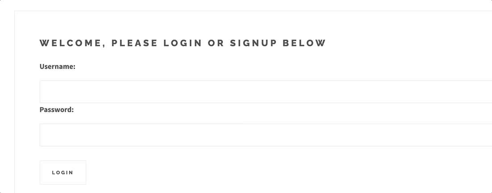

# Getting Started with Create React App

This project was bootstrapped with [Create React App](https://github.com/facebook/create-react-app).

# Rails Backend

The associated Rails backend for this project can be found [here](https://github.com/Soundwood/HomeCalc-backend)
Go through the full setup process to use this app.

# About

SMARTHOMECALC (HOMECALC frontend) is intended to be used with the HOMECALC API backend. The site allows a user to login and signup and keep track of their own 'scenarios'. These 'scenarios' include information like net income credit score and total monthly debt. No need to provide local property tax rates or mortgage interest rates. SMARTHOMECOST then uses this information and several 'Rules of Thumb' to determine how much home the user, given that particular scenario, can afford. The analysis of each are arranged from most to least frugal and provide some additional information such as the resulting monthly mortgage and tax costs.

# How to Use / Setup

1. Install and run the rails server (Link above)
2. Clone this repo
3. Run 'npm start' (Should automatically open browser to localhost:3001)
4. Signup and start creating scenarios

# Walkthrough

## Login / Signup

## Create Scenario

## Modify / Delete Scenario

## View Analysis